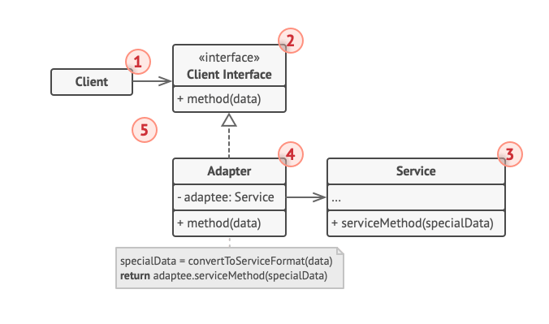

# Structural Patterns  
## Adapter

Adapter is a structural design pattern that allows objects with incompatible interfaces to collaborate.
წარმოვიდგინოთ რომ ვემუშავებით რაღაც ბანძ ძველ აპლიკაციას, რომელიც მონაცემთა მიმოცვლისთვის და ინფორმაციის შესანახად
XML ფორმატს იყენებს. ახლა წარმოვიდგინოთ რომ ამ აპლიკაციაში ახალი ბიბლიოთეკის დამატება გვინდა, რომელიც
ჩვენს მონაცემებს ლამაზად დახატავს და სხვადასხვა ჩარტებისა თუ ნახაზების სახით წარმოადგენს. იდეა კარგია მაგრამ
ასევე აღმოჩნდა რომ ეს ბიბლიოთეკა json სახის მონაცემებზე მუშაობს მხოლოდ და XML არ გვაწყობს. ორი ვარიანტი
გვაქვს:
1. გადავწეროთ აპლიკაცია ისე რომ json ფორმატზე იმუშავოს (რაც ფაქტობრივად მისაღები არაა)
2. შევქმნათ ერთგვარი გადამყვანი ამ ბიბლიოთეკისთვის, რომელიც ჩვენს მონაცემებს xml დან json ში გადაიყვანს
და ისე აჭმევს ამ ბიბლიოთეკას 

რა თქმა უნდა, მეორე ვარიანტი უფრო გამოგვადგება ამ ქეისში ვიდრე პირველი,
ვინაიდან ყველამ ვიცით რა ტკივილია ლეგასი ფუნქციონალის გადაწერა. ზუსტად ასეთ
ქეისებში ვიყენებთ Adapter pattern ს.

ზემოთ მოცემულ მაგალითში:
1. Client არის კლასი რომელშიც ძირითადი ბიზნეს ლოგიკა წერია
2. Client Interface არის ამ კლიენტის ინტერფეისი სადაც მისი მეთოდებია
აღწერილი
3. Service არის რაღაც გამოსადეგი 3rd party ან ნებისმიერი სერვისი
რომელიც მიმდინარე ლოგიკით არ გვადგება, თუმცა გვჭირდება.
4. Adapter კლასია რომელსაც შეუძლია ემუშავოს როგორც Client ს ასევე
Service ს და აიძულოს მათ კოლაბორაცია.

შეგვიძლია იგივე ქეისის კოდის მაგალითიც ვნახოთ.

### Pros and Cons
* Single Responsibility Principle. You can separate the interface or data conversion code from the primary business logic of the program.
* Open/Closed Principle. You can introduce new types of adapters into the program without breaking the existing client code, as long as they work with the adapters through the client interface.
* The overall complexity of the code increases because you need to introduce a set of new interfaces and classes. Sometimes it’s simpler just to change the service class so that it matches the rest of your code.

## Bridge

ბრიჯი არის სტრუქტურული დიზაინ პატერნი, რომელიც საშუალებას გვძლევს ორად დავყოთ ერთი დიდი კლასი ან ერთმანეთთან
დაკავშირებული კლასები ორ ცალცალკე იერარქიად, რომლებიც დამოუკიდებლად განვითარდებიან. ერთი იერარქია აბსტრაქცია იქნება ხოლო მეორე
იმპლემენტაცია. 

რთულად ჟღერს? მოდი ვნახოთ მარტივი მაგალითი:

ვთქვათ გვაქვს კლასი Shape და მისი 2 საბკლასი Circle და Square. ამ იერარქიაში მოგვინდა გაგვეჩინა ფერის ცნება.
გამომდინარე აქედან პირდაპირი გზა გვაქვს რომ შევქმნათ წითელი და ლურჯი წრის და კვადრატის კლასები. გამომდინარე აქედან
დაგვჭირდება შევქმნათ 4 Shape ის საბკლასი. ამ იერარქიაში ახალი ფორმის ტიპისა და ფერის დამატება გამოიწვევს კლასების რაოდენობის
უაზრო ზრდას.  
ამ კონკრეტულ შემთხვევაში პრობლემა იმაშია რომ ჩვენ ვცდილობთ Shape კლასის განგრძობას ორი დამოუკიდებელი განზომილების მიხედვით,
ფორმითა და ფერით. Bridge პატერნი ამ პრობლემის გადაჭრის ცდილობს მემკვიდრეობის კომპოზიციით ჩანაცვლებით. 
ამ მიდგომით ორიგინალ Shape კლასში გვექნება რეფერენსი ფერზე და ბევრი კლასების კომბინაციის შექმნა აღარ მოგვიწევს.

ამ მიდგომას თუ გავყვებით შეგვიძლია Shape და ფერთან დაკავშირებული ლოგიკა ერთმანეთისგან განვაცალკევოთ და შევქმნათ
Color კლასი, რომელსაც ორი შვილობილი ეყოლება წითელი და ლურჯი. Shape კლასში ამის შემდეგ ჩაემატება Reference 
Color კლასზე. ამის შემდეგ Shape კლასს შეუძლია ნებისმიერი ფერთან დაკავშრებული საქმე დააკისროს Color კლასს. ასევე ახალი ფერების
დამატება ამის შემდეგ აღარ მოითხოვს ახალი კლასების შექმნას.

Imagine you have a TV remote. The remote lets you perform actions like turning the TV on or off and changing the channel. Now, let's say you have different types of TVs: an LED TV, an LCD TV, and a Smart TV. You want to use the same remote for all these types of TVs without changing how the remote works.

Bridge Pattern helps you achieve this by separating the remote control (abstraction) from the TV (implementation). Here's how it works:

Abstraction (Remote Control):

This represents the remote control with basic functionalities like turnOn(), turnOff(), and changeChannel().
Refined Abstraction:

These are different types of remotes, like a Basic Remote or an Advanced Remote, that extend the functionality of the main remote.
Implementation (TV):

This is the interface for different types of TVs, with methods like powerOn(), powerOff(), and switchChannel().
Concrete Implementation:

These are the specific types of TVs (LED TV, LCD TV, Smart TV) that implement the TV interface.
By using the Bridge pattern, you can independently change the remote control's features and the TV types. The remote doesn't need to know the details of how each TV works; it only needs to know that the TV has certain capabilities (defined by the TV interface).

### Pros and Cons

* You can create platform-independent classes and apps.
* The client code works with high-level abstractions. It isn’t exposed to the platform details.
* Open/Closed Principle. You can introduce new abstractions and implementations independently from each other.
* Single Responsibility Principle. You can focus on high-level logic in the abstraction and on platform details in the implementation.
* X You might make the code more complicated by applying the pattern to a highly cohesive class.

## Composite

კომპოზიტი არის დიზაინ პატერნი, რომელიც საშუალებას გვაძლევს ჩვენი ობიექტები მოვაწყოთ ხის სტრუქტურის მსგავსად.
კომპოზიტ პატრენის გამოყენებას მაშინ აქვს აზრი როცა ჩვენი ფუნქციონალის ძირითადი მოდელი წარმოდგენადია, როგორც
ხის სტრუქტურა. 

მაგალითად, წარმოვიდგინოთ რომ აპლიკაციაში გვაქვს ორი სახის ობიექტი: პროდუქტი და ყუთი. ყუთში შეიძლება გვქონდეს სხვა
პროდუქტებიც და შედარებით პატარა ყუთებიც. ამ პატარა ყუთებში ასევე შიძლება იყოს კიდევ სხვა პროდუქტები და სხვა პატარა
ყუთები და ა.შ. 

ვთქვათ ამ სისტემისთვის გადავწყვიტეთ შეკვეთების სიტემის ჩამატება ჩვენს აპლიკაციაში. შეკვეთაში შეიძლება იყოს როგორც უბრალოდ
ერთი პროდუქტი ასევე ყუთი მთელი თავისი შიგთავსით. ამ პროდუქტების სრულ ფასს როგორ დავთვლიდით? 
შეგვიძლია ყველაზე მარტივად წარმოსადგენი და პირდაპირი მიდგომა გამოვიყენოთ: გავხსნათ ყველა ყუთი და სათითაოდ დავაჯამოთ
მასში არსებული პროდუქტების ფასი, ამ ყუთში არსებული დანარჩენი ყუთებიც ასევე გავხსნათ და შევაჯამოთ მათი პროდუქტების ფასი
და ა.შ. რეალურ ცხოვრებაში ამის გაკეთება შესაძლებელია, მოსაწყენია მაგრამ შესაძლებელი. მაგრამ აპლიკაციაში ამ მიდგომის იმპლემენტაციისას
გადავაწყდებით პრობლემებს. მაგალითად, ჩვენ უნდა ვიცოდეთ ყველა ყუთისა და პროდუქტის ტიპი, როცა ამ მიდგომას გამოვიყენებთ, ასევე
უნდა ვიცოდეთ რა დონეზე არის ჩადგმული ეს ყუთები ერთმანეთში და სხვა ათასი დეტალი რომ ჩვენი აპლიკაცია როგორღაც ავამუშავოთ.

ამ შემთხვევაში კომპოზიტ პატერნი გვირჩევს რომ პროდუქტებთან და ყუთებთან სამუშაოდ გამოვიყენოთ ერთიდაიგივე ინტერფეისი
რომელშიც გამოცხადებული იქნება ჯამური ფასის დათვლის მეთოდი. 
პროდუქტებისთვის ეს მეთოდი პირდაპირ ფასს დააბრუნებს, ხოლო ყუთებისთვის იგი ჩამოუვლის ყველა პროდუქტს, გამოიძახებს იგივე
მეთოდს და აჯამავს ფასს. თუ ისევ ყუთი შეგვხვდება ყუთში ამ შემთხვევაშიც ისევ ჯამური ფასის დათვლის მეთოდი გამოიძახება,
რომელიც უკვე ამ ჩადგმული ყუთის პროდუქტების ფასის შეკრებას დაიწყებს და ა.შ. ასე გაგრძელდება სანამ ყველაფრის ფასი არ დაითვლება.

ამ მიდგომის ბენეფიტი ისაა, რომ არ გვაღელვებს კონკრეტულად რა კლასებს ვემუშავებით ხეში. სხვადასხვა პროდუქტი იქნება თუ ყუთი
ვიცით რომ ყველა მათგანს ერთი საერთო მეთოდი ექნება და მისი დახმარებით შეგვიძლია საჭირო საქმე შევასრულოთ.

### Pros and Cons:
* ✅ შეგვიძლია ვემუშავოთ კომპლექსურ ხის სტრუქტრურებს უფრო მოხერხებულად. გამოვიყენებთ პოლიმორფიზმსა და რეკურსიას ჩვენთვის სასიკეთოდ
* ✅ დავიცავთ Open/Closed პრინციპს. შეგვიძლია ჩვენს ფუნქციონალში გავაჩნოთ ახალი ელემენტები და ლოგიკა არსებულის გაუფუჭებლად

* ❌ ხშირ შემთხვევაში რთული იქნება ისეთი კლასების საერთო ინტერფეისზე მორგება, რომლებიც საკმაოდ განსხვავებულ ფუნქციებს ასრულებენ.
ამის გამო მოგვიწევს ინტერფეისის უფრო და უფრო განზოგადება, რაც გაართულებს საქმეს.

### სხვა პატერნებთან დამოკიდებულებები
* You can use Builder when creating complex Composite trees because you can program its construction steps to work recursively.

* Chain of Responsibility is often used in conjunction with Composite. In this case, when a leaf component gets a request, it may pass it through the chain of all of the parent components down to the root of the object tree.

* You can use Iterators to traverse Composite trees.

* You can use Visitor to execute an operation over an entire Composite tree.

* You can implement shared leaf nodes of the Composite tree as Flyweights to save some RAM.

* Composite and Decorator have similar structure diagrams since both rely on recursive composition to organize an open-ended number of objects.

* A Decorator is like a Composite but only has one child component. There’s another significant difference: Decorator adds additional responsibilities to the wrapped object, while Composite just “sums up” its children’s results.

* However, the patterns can also cooperate: you can use Decorator to extend the behavior of a specific object in the Composite tree.

* Designs that make heavy use of Composite and Decorator can often benefit from using Prototype. Applying the pattern lets you clone complex structures instead of re-constructing them from scratch.

## Decorator
დეკორატორი არის სტრუქტურული დიზაინ პატერნი, რომელიც საშუალებას გვაძლევს ობიექტებს დავამტოთ ახალი ქცევა ვრაპერში მოქცევის
დახმარებით.

წარმოვიდგინოთ რომ notifier ბიბლიოთეკაზე ვმუშაობთ, რომელიც მის მომხმარებლებს ინფორმაციას აწვდის საჭირო
ივენთების შესახებ. საწყისი Notifier კლასის ვერსიას ჰქონდა მხოლოდ რამდენიმე ფოფერთი და ერთი გაგზავნის მეთოდი. მას
შეეძლო კლიენტისგან მიეღო მესიჯი და გაეგზავნა იგი ყველა მეილისთვის, რომელიც კონსტრუქტორში გადმოგზავნილ მეილების სიას
გაეგზავნებაოდა. 3rd party აპლიკაციას, რომელიც ამ შემთხვევაში კლიენტის როლს თამაშობს, უნდა შეექმნა და დაეკონფიგურირებინა
Notifier ობიექტი ერთხელ და საჭიროების შემთხვევაში მისი დახმარებით უნდა გაგეგზავნა მეილი. რაღაც დროის შემდეგ მოვიდა
მოთხოვნა რომ შექმნილიყო ახალი ფუნქციონალი ნოტიფიკაციების სხვა წყაროებში გასაგზავნად, მაგალითად სმს, ფეისბუქის ან
სლექის ნოტიფიკაცია. თითქოს რთული არ ჩანს ხომ? ვქმნით Notifier კლასის საბკლასებს და მათში ვწერთ ახალი ნოტიფიკაციების
გაგზავნის ლოგიკებს. ახლა კლიენტმა უნდა შექმნას მისთვის საჭირო ნოტიფიკაციის ობიექტი და გამოიყენოს იგი. ამასობაში
რომელიღაც ჭკვიანი იკითხავს: რატომ არ შეიძლება ნოტიფიკაციები გაიგზავნოს ყველა ჩენელში ერთად? წარმოვიდგინოთ, რომ
ამ პრობლემის გადასაჭრელად გადავწყვიტეთ კიდევ მეტი საბკლასი შეგვექმნა ყველა არსებული ნოტიფიკაციის ტიპის კომბინაციით.
მიხვდებოდით რომ ასეთი მიდგომა არაა ლოგიკური და მეტად სასიამოვნო, ვინაიდან კოდში შემოაქვს ქაოსი და თავად ბიბლიოთეკაც'
ხდება რთულად გამოსადეგი. 

კლასის დაექსტენდება არის პირველი რამე რაც თავში მოგვდის, როცა ობიექტის ლოგიკაში
ცვლილება გვაქვს შესატანი. თუმცაღა ინჰერიტენსს რამდენიმე სერიოზული პრობლემა აქვს რომელიც უნდა გავითვალისინოთ.

* ინჰერიტენსი სტატიკურია. რანთაიმში რომელი კლასი ვისი შვილია ამის დაედითების საშუალება არ გვაქვს.
* საბკლასებისთვის დაშვებულია მხოლოდ ერთი მშობელი კლასის ყოლა.

ამ პრობლემის მოგვარების ერთ-ერთი გზაა აგრეგაციის ან კომპოზიციის გამოყენება ინჰერიტენსის მაგივრად. ორივე
მსგავსად მუშაობს, ერთ ობიექტს მეორე ობიექტის რეფერენსი აქვს და საქმის ნაწილის მას უნაწილებს. ინჰერიტენსის
დროს დელეგირებულ საქმეც თავად ობიექტს შეუძლია გააკეთოს, ვინაიდან ლოგიკა და კოდი მიიღო მშობლისგან. ამ
მიდგომით შეგვიძლია ერთ ობიექტში ჩავსვათ დამხმარე მეორე ობიექტი და საჭირო საქმე შევასრულებინოთ რანთაიმში.
მოკლედ რომ ვთქვათ კომპოზიცია და აგრეგაცია არის არაერთი პატერნის უკან მდგომი რეალური ძალა, მათ შორის, დეკორატორ
პატერნისაც.

Wrapper არის ალტერნატიული სახელწოდება დეკორეტორისთვის და იგი მის დანიშნულებაზე მიანიშნებს. Wrapper
არის ობეიქტი, რომელიც შეგვიძლია დავლინკოთ სხვა სამიზნე ობიექტთან. ვრაპერი შეიცავს იგივე მეთოდების ჩამონათვალს
რასაც სამიზნე ობიექტი და ვრაპერი მას უგზავნის ყველა შემოსულ რექვესთს დასამუშავებლად. 

როდის გადაიქცევა უბრალოდ ვრაპერი ნამდვილ დეკორატორად? როგორც უკვე ვახსენეთ Wrapper იიმპლემენტირებს ზუსტად
იგივე მეთოდებს რასაც დავრაპული ობიექტი. გამომდინარე აქედან კლიენტის გადმოსახედიდან ვრაპერი არ განსხვავდება
თავად ორიგინალი ობიექტისაგან. ვრაპერში შეგვიძლია დავაინჯექტოთ ან უბრალოდ ref field ად გვქონდეს არა კონკრეტული
კლასი არამედ ინტერფეისი, რათა შევქმნათ საშუალება რომ ამ ინტერფეისის ნებისმიერი იმპლემენტატორი იყოს შეფუთვადი.

ჩვენს ნოტიფიკაციების მაგალითში შეგვიძლია ნოტიფიკაციის ბეიზ ფუნქციონალი დავტოვოთ Notifier კლასში, ხოლო
დანარჩენი ვარიაციები გავიტანოთ როგორც დეკორატორები.  
თავად კლიენტი სტეკში ბოლო დეკორატორს ემუშავება. თუმცაღა ვინაიდან ყველა დეკორატორი ერთიდაიმავე ინტერფეისს
იიმპლემენტირებს, კლიენტისთვის დიდი აზრი არ აქვს რომელს ემუშავება.

### როდის გამოვიყენოთ?
1. დეკორატორების გამოყენება შეგივძლია მაშინ, როცა გვჭირდება ობიექტისთვის ექტრა საქმის მიბმა რანთაიმში, ისე რომ
ობიექტის ლოგიკა არ დაირღვეს.
2. შეგვიძლია ასევე იგივე პატერნი დავიხმაროთ, როცა ვემუშავებით ისეთ კოდს რომელშიც ცვლილების შეტანას სამსახურიდან წასლვა ჯობია.

### Pros and Cons

* ✅ ობიექტის ლოგიკის განგრძობა შეგვიძლია შვილობილი კლასის შექმნის გარეშ
* ✅ შეგვიძლია კლასი შევფუთოთ ახალ ლოგიკებში რანთაიმში
* ✅ შეგვიძლია კლასს დავამატოთ რამდენიმე ფუნქცია მისი რამდენიმე ვრაპერში მოქცევით
* ✅ SRP შეგვიძლია მონოლითი კალსი დავყოთ ძირითად კლასად და მის რამდენიმე ვარინტად ამ პრინციპით (თუ შესაძლებელია)

* ❌ თუ კლასს რამდენიმე ვრაპერში შევფუთავთ, აქედან კონკრეტულის მოცილება შემდეგ რთულია
* ❌ შედარებით რთულია ამ მიდგომისთვის დეკორატორების ისე იმპლემენტირება, რომ მათი ლოგიკა სტეკში 
დეკორატორების თანმიმდევრობაზე არ იყოს დამოკიდებული.
* ❌ საწყისი კონფიგურაციის კოდი (ამ მიდგომის გამოსაყენებლად) სავარაუდოდ მახინჯი იქნება.

## Facade

Facade არის სტრუქტურული დიზაინ პატერნი, რომელიც მარტივ ინტერფეისს გვაწვდის ბიბლიოთეკისთვის, ფრეიმვორკისთვის
ან სხვა ნებისმიერი რთული კლასთა ნაკრებისთვის. 

წარმოვიდგინოთ რომ ჩვენი კოდი უნდა ვამუშავოთ დიდ რაოდენობა ჩვენთვის უცნობ ბიბლიოთეკის ან ფრეიმვორკის
ობიექტებთან. ასეთ შემთხვევაში, სავარაუდოდ, მოგვიწევდა ყველა საჭირო ობჯექტის ინიციალიზაცია, ასევე მათთვის საჭირო
დამოკიდებულებების შექმნა და მეთოდების საჭირო თანმიმდევრობით განხორციელება და ა.შ. 

ამის გამო ჩვენი ბიზნეს ლოგიკა გახდებოდა საკმაოდ მიჯაჭვული 3rd party კლასებთან რაც მას მოუქნელსა და რთულად
შეცვლადს გახდიდა.

Facade არის კლასი, რომელიც გვაწვდის მარტივ ინტერფეისს (წვდომის წერტილს) რთულ საბსისტემაზე, რომელსაც
მრავალი ცოცხალი ნაწილი აქვს, მოკლედ არის კომპლექსური. შესაძლოა პირდაპირ საბსისტემის გამოყენებისგან განსხვავებით
Facade მა შეზღუდული წვდომა მოგვცეს ამ ქვესისტემის ფუნქციონალზე, მაგრამ იგი გვაწვდის მხოლოდ იმ ფუნქციონალს,
რომელიც კლიენტს მართლა სჭირდება.

Facade ი ძალიან გამოსადეგია, როცა გვჭირდება აპლიკაციაში რაღაც რთული, მრავალფუნქციური ბიბლიოთეკის ჩამატება, რომლისგანაც მხოლოდ
ერთი პაწია feature გვჭირდება. მაგალითად, როდესაც ჩვენ ვრეკავთ რაღაც სერვისის მისაღებად, ოპერატორი წარმოადგენს
Facade კლასს. იგი გვაწვდის მარტივ ხმოვან ინტერფეისს შეკვეთების სისტემასთან, გადახდის სისტემასთან და მიტანის სერვისთან.
თუმცა ამ ინტერფეისის უკან დგას ათასი რაღაც.

### როდის გამოვიყენოთ?
1. შეგვიძლია Facade პატერნი გამოვიყენოთ მაშინ როცა გვჭირდება შევქმნათ მარტივი, მაგრამ შეზღუდული წვდომა კომპლექსურ
საბსისტემასთან
2. შეგვიძლია გამოვიყენოთ როცა გვჭირდება საბსისტემის შრეებად დაშლა.

### Pros and Cons

* ✅ შეგვიძლია კოდის იზოლირება რაღაც საბსისტემის კომპლექსურობისგან.
* ❌ Facade შეიძლება გადაიქცეს god object ად

## Flyweight

Flyweight არის სტრუქტურული დიზაინ პატერნი, რომელიც საშუალებას გვაძლევს მეტი ობიექტი შევინახოთ ხელმისაწვდომ
RAM მეხსიერებაში. ამას იგი ასრულებს ობიექტებს შორის საზიარო ინფორმაციის ერთ ადგილას შენახვით და არა ყველა ობიექტში
სათითაოდ.

წარმოვიდგინოთ რომ ვქმნით ვიდეოთამაშს. მისი ერთ-ერთი მნიშვნელოვანი Feature არის ნაწილაკების სისტემა.
ყველა გასროლილი ტყვია, აფეთქების შედეგად გაფანტული მტვერი და ნამტვრევები და ა.შ. ყველაფერი უნდა დარენდერდეს.
თამაშის საკუთარ კომპზე გატესტვის შემდეგ #ჩემსმანქანაზემუშაობს ბილდს ვაძლევთ მეგობარს და ასევე ვატესტინებთ.
აღმოჩნდა რომ მეგობრის მანქანაზე თამაში მალევე იქრაშება. პრობლემის გამოკვლევის შემდეგ დავადგინეთ, რომ
მეგობრის მანქანაზე თამაში არასაკმარისი RAM ის გამო იქრაშებოდა მალევე. უფრო კონკრეტულად RAM ის გადავსებას
ჩვენი ნაწილაკების სისტემა იწვევდა. თითოეულ ნაწილაკს საკუთარი ობიექტი ჰქონდა ტონა ინფორმაციით რაც რასაკვირველია
შედარებით სუსტ მანქანაზე მალევე გამოიწვევდა მეხსიერების გადავსებას და ახალი ნაწილაკების ჩატვირთვისას შეცდომას.

ჩვენი ობიექტების მეხსიერების ანალიზის შედეგს თუ დავაკვირდებით შევამჩნევთ რომ თითოეულ ობიექტში ყველაზე მეტი
მეხსიერება უკავია sprite და color ველებს. ასევე შევამჩნევთ რომ ეს ველები ყველა ობიექტში ერთიდაიგივე მნიშვნელობისაა.

state ის სხვა მონაცემები უნიკალურია თითოეული ნაწილაკისთვის. მაგალითად სიჩქარე, მიმართულება და კოორდინატები,
ეს მონაცემები ნაწილაკებისთვის ყოველთვის იცვლება განსხვავებით ტექსტურისა და ფერისგან.

state ის უცვლელ ნაწილს შიდა მდგომარეობას უწოდებენ. იგი ობიექტის ნაწილია და მისი მოდიფიკაცია დაშვებული არაა.
ობიექტის მდგომარეობის დარჩენილ ცვლად ნწილს გარე მდგომარეობა ეწოდება, ვინაიდან იგი გარედან ცვლადია.

Flyweight პატერნი გვირჩევს რომ შევწყვიტოთ extrinsic state ის ობიექტში შენახვა. ობიექტში მხოლოდ intrinsic state ის
მონაცემები უნდა შევინახოთ, ხოლო დანარჩენი მონაცემები მეთოდს სხვა წყაროდან უნდა შემოვაწოდოთ. ანუ აქამდე გარე მდგომარეობის
გამო თუ ვქმნიდით მილიონ ნაწილაკს, ახლა მხოლოდ 3 ნაწილაკის (ტყვია, ყუმბარის ნამსხვრევი, მტვერი) ობიექტი გვექნება, რომელში შენახული იქნება შიდა მდგომარეობის მონაცემები.
ასეთ ობიექტებს ეწოდება flyweight. სანამ დეტალებში გავაგრძელებთ ჩვენი თამაშის მაგალითი კიდევ ერთხელ შეგვიძლია ვნახოთ,
ახლა უკვე ამ მიდგომით. გვექნება 3 flyweight ობიექტი შიდა მდგომარეობის ინფორმაციით, რომლებიც ჯამში 60-70 კილობაიტს წაიღებს და დანარჩენი მონაცემები ცალკე
მილიონი ტყვიისთვის 32 ბაიტი თითო, მილიონზე სადღაც 32 მბ. 21 გბ დან ჩამოვედით 32 მბ ზე.

რა თქმა უნდა, გაგიჩნდებოდათ კითხვა რომ ამოვიღეთ ეს გარე მდგომარეობის მონაცემები ობიექტიდან სად წავიღოთო. სადღაც მაინც უნდა შევინახოთ ხომ?
ეს შეიძლება იყოს უკვე ცალკე ნებისმიერი კლასი, რომელიც სანახის როლს ითამაშებს. მაგალითად singletone memoryStorage ან რამე მსგავსი.
უფრო ელეგანტური მიდგომაა რომ ცალკე კონტექსტ კლასი შევქმნათ, რომელიც შეინახავს გარე მდგომარეობის მონაცემებს და flyweight კლასზე
რეფერენსს. რომ დავფიქრდეთ რაოდენობრივად ეს კონტექსტ კლასებიც მილიონი უნდა შევქმნათ. სხვაობა ისაა რომ მანამდე თუ მძიმე მონაცემები
ყველგან მეორდებოდა, ახლა ისინი ერთ წერტილში არიან მოთავსებული და გაზიარებულია ამ მილიონ ნაწილაკს შორის რაც საკმაო რაოდენობის მეხსიერებას
ზოგავს.

ვინაიდან ერთი Flyweight ობიექტი ბევრგან შეიძლება იყოს გამოყენებული, აუცილებლად უნდა გავითვალიწინოთ რომ იგი immutable უნდა იყოს.

flyweight ობიექტებთან სამუშაოდ შეგვიძლია Factory იც შევქმნათ, რომელიც უზრუნველყოფს ამ ობიექტების პულთან მუშაობას.

### When to use?
1. Use the Flyweight pattern only when your program must support a huge number of objects which barely fit into available RAM.

### Pros and Cons
* ✅ ძალიან დიდი რაოდენობის მეხსიერების დაზოგვა შეგვიძლია (თუ ჩვენი აპლიკაცია ტონა მეხსიერებას მოიხმარს)

* ❌ შეიძლება RAM ის დაზოგვა დაგვიჯდეს CPU ზე დატვირთვის გაზრდად, ვინაიდან ყოველ ჯერზე როცა კონტექსტის მეთოდს
გამოვიძახებთ შესაძლოა მისი მონაცემების რეკალკულაცია გვჭირდებოდეს.
* ❌ კოდი რთულდება

## Proxy

პროქსი არის სტრუქტურული დიზაინ პატერნი, რომელიც საშუალებას გვაძლევს სხვა ობიექტის მაგივრად გამოვიყენოთ ასე ვთქვათ მოკი ან 
ფლეისჰოლდერი. პროქსი აკონტროლებს წვდომას ორიგინალ ობიექტზე, რაც საშუალებას გვაძლევს შევასრულოთ მოქმედებები
მანამდე ან მას შემდეგ რაც რექვესთი გადაეწოდება ორიგინალ ობიექტს.

პროქსი პატერნი გვთავაზობს შევქმნათ ორიგინალი ობიექტის შემფუთავი პროქსი კლასი. როდესაც ამ კლასს მივმართავთ იგი შექმნის
ორიგინალ ობიექტსაც თუ უვკე შექმნილი არაა. პროქსი პატერნი საშუალებას გვაძლევს ასევე წავამატოთ ფუნქციონალი არსებულ სერვისებს ისე რომ
რამე არ გავაფუჭოთ. თუმცაღა სატესტოდ უფრო გამოიყენება ხოლმე ეს პროქსი.

### Pros and Cons
* ✅ You can control the service object without clients knowing about it.
* ✅ You can manage the lifecycle of the service object when clients don’t care about it.
* ✅ The proxy works even if the service object isn’t ready or is not available.
* ✅ Open/Closed Principle. You can introduce new proxies without changing the service or clients.

* ❌ The code may become more complicated since you need to introduce a lot of new classes.
* ❌ The response from the service might get delayed.